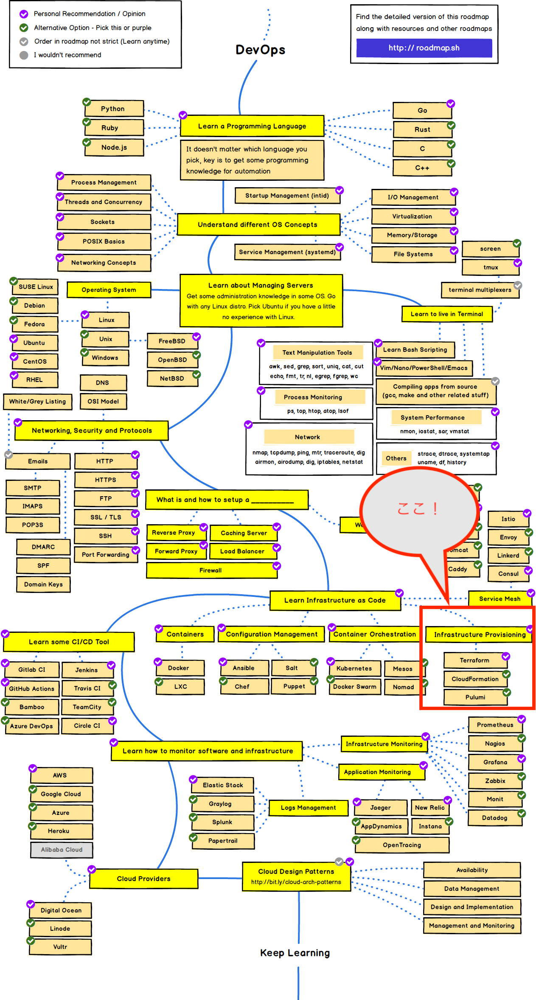

# TerraForm学習

DevOpsエンジニアの必須科目インフラのコード化について学びます

今回はマルチプラットフォームで利用でき、デファクトスタンダートになっているTerrFormを学習します

- 基本構文
- 応用的な構文（制御構文)
- 実際にAWSリソースを作成

といったハンズオン内容をまとめます。

この学習を皮切りに、テラフォーム資格にもチャレンジします。
https://www.hashicorp.com/certification/terraform-associate

